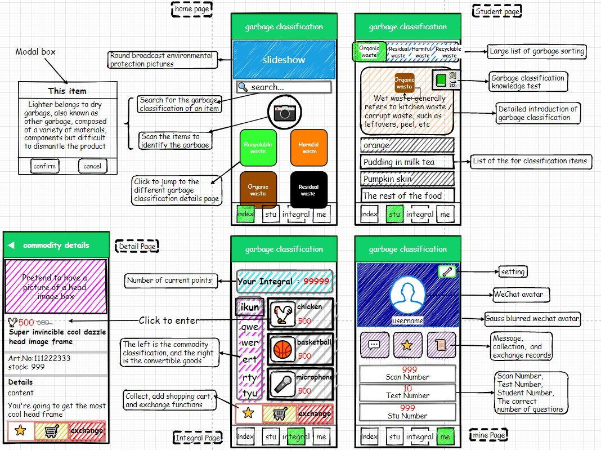
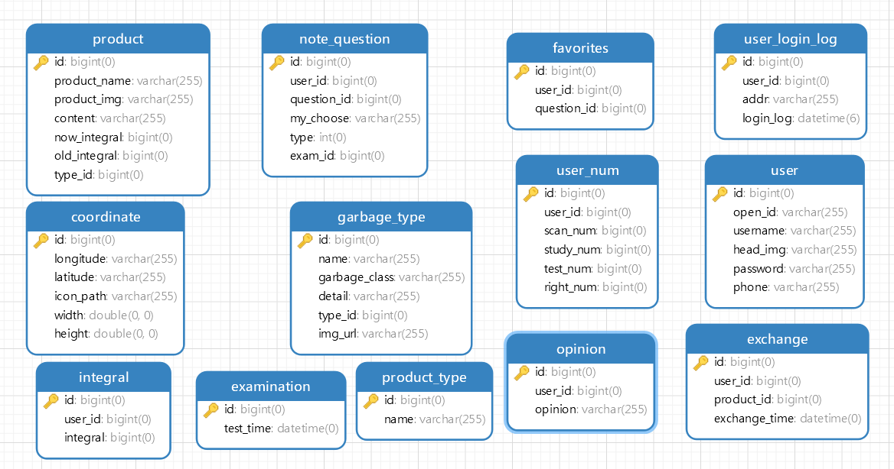
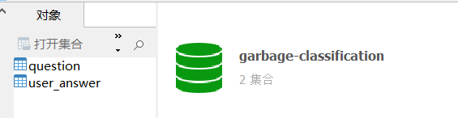

# 垃圾分类微信小程序
> 作者：爱吃炸排骨呀   

### 前后端分离
- 后端： Java
- 前端： 微信小程序
---
### 技术栈 
后端
- Spring Boot
- Mybatis-Plus
- MySQL
- MongoDB
- Fastjson
- okhttp

前端  
- uni-app    
---
### 第三方接口
- OSS对象存储
- 百度AI识别
- 微信code2Session
---
### 开发工具
- IDEA
- HBuilder X
- 微信开发者工具
- Navicat
- Postman
- Chrome浏览器
---
### 低保真模型
应该是叫**低保真模型**吧，然后就叫**草图**好啦，不太记得了
没有用**墨刀**、**Axure**以及**figma**（我用过的只有这几种，别的不太清楚），
而且也没有做**高保真模型**，比较懒了属于是。。。 这个图是用**drawio**画的，一般用来话流程图比较多，不建议学我这样画 
> 补充一下：     
>  - 问：为什么做的页面好像和你画的模型不太一样？？？  
>     因为这个只是初稿，所以和最后实现的不太一样也很正常（其实主要原因是我前端太差了，还原不出来，但是我不能说。。。）
>                   
> 
> - 问：为什么图片上都是英文        
>   因为英文看起来比较装X吧。。。

---
### 数据库设计
MySQL数据表，其实也没有满足三范式，也没有外键、索引之类的，因为我的打算是一切从简，能省则省
，一共十三张表

MongoDB一共两张表，分别是测试题目集合和用户答题卡集合

### 主要功能
#### 首页
- 轮播图
- 输入框搜索垃圾分类
- AI识别垃圾分类
- 垃圾分类学习（跳转到学习页面）
- 附近的垃圾桶

#### 学习页面
- 导航栏
- 垃圾分类详情
- 垃圾分类列表
- 练习
- 记录
- 测试

#### 积分页面
- 显示当前积分
- 左侧商品分类
- 右侧商品列表及兑换

#### 我的页面
- 登录
- 显示用户信息(头像、昵称)
- 用户修改个人信息(头像、昵称)
- 用户 扫描、学习、测试次数
- 订单
- 收藏
- 电话客服、微信客服
- 意见反馈
- 关于我们
- 应用分享

### 用到的文档
[uni-app官方文档](https://uniapp.dcloud.net.cn/)    
[微信小程序官方文档](https://developers.weixin.qq.com/miniprogram/dev/framework/)    
[MongoDB官方文档](https://www.mongodb.com/)     
[百度AI识别官方文档](https://ai.baidu.com/ai-doc/IMAGERECOGNITION/Xk3bcxe21)

### 替你们问我几个问题
>问：uni-app学了多久?     
>答：其实uni-app我就看来两天黑马的视频，然后做的时候就是看官方文档   
> 我看的是这个视频👇👇👇
>    

> 问：项目开源吗?  
> 答：等我答辩完之后可以开源

> 问：AI识别要收费吗?   
> 答：免费的哈！每个月免费一千次还是一万次来着，记不清了

> 问：积分兑换的东西为什么都没有收货地址?  
> 答：因为目前积分兑换的商品都只是假数据，我不打算积分兑换实体的物品，
> 因为如果是实体物品的话还需要收货地址，，，一堆东西，而如果只是虚拟的
> 物品（例如，头像框、主题、设置背景。。。这些虚拟的商品）就不需要用户
> 收货，只需要用户点击兑换，再在订单页面点击使用即可

> 问：为什么不是用Redis或者一些高并发的技术?  
> 答：不是吧，阿sir!就是个毕设，能交就行了，一切从简了，而且 用户人数=开发人数，
> duck不必如此完美

> 问：小程序里面的图片都是你自己做的吗?   
> 答：那当然。。。不是啦！我哪有这闲工夫，都是百度的，然后右键复制图像链接

# 数据库设计文档

**数据库名：** garbage-classification

**文档版本：** 1.0.0

**文档描述：** GCB数据库设计文档

| 表名                  | 说明       |
| :---: | :---: |
| [coordinate]() | 附近垃圾桶表 |
| [examination]() | 测试/练习时间表 |
| [exchange]() | 兑换表 |
| [favorites]() | 收藏表 |
| [garbage_type]() | 垃圾分类表 |
| [integral]() | 积分表 |
| [note_question]() | 错题表 |
| [opinion]() | 意见反馈表 |
| [product]() | 商品表 |
| [product_type]() | 商品分类表 |
| [user]() | 用户表 |
| [user_login_log]() | 用户登录日志 |
| [user_num]() | 用户各数据表 |

**表名：** <a id="coordinate">coordinate</a>

**说明：** 用户附近垃圾桶位置坐标

**数据列：**

| 序号 | 名称 | 数据类型 |  长度  | 小数位 | 允许空值 | 主键 | 默认值 | 说明 |
| :---: | :---: | :---: | :---: | :---: | :---: | :---: | :---: | :---: |
|  1   | id |   bigint   | 20 |   0    |    N     |  Y   |       | 坐标ID  |
|  2   | longitude |   varchar   | 255 |   0    |    Y     |  N   |       | 维度  |
|  3   | latitude |   varchar   | 255 |   0    |    Y     |  N   |       | 经度  |
|  4   | icon_path |   varchar   | 255 |   0    |    Y     |  N   |       | 图标URL  |
|  5   | width |   double   | 23 |   0    |    Y     |  N   |       | 图标宽度  |
|  6   | height |   double   | 23 |   0    |    Y     |  N   |       | 图标高度  |

**表名：** <a id="examination">examination</a>

**说明：** 练习/测试 时间表

**数据列：**

| 序号 | 名称 | 数据类型 |  长度  | 小数位 | 允许空值 | 主键 | 默认值 | 说明 |
| :---: | :---: | :---: | :---: | :---: | :---: | :---: | :---: | :---: |
|  1   | id |   bigint   | 20 |   0    |    N     |  Y   |       | 考场ID  |
|  2   | test_time |   datetime   | 19 |   0    |    Y     |  N   |       | 测试时间  |

**表名：** <a id="exchange">exchange</a>

**说明：** 兑换商品表

**数据列：**

| 序号 | 名称 | 数据类型 |  长度  | 小数位 | 允许空值 | 主键 | 默认值 | 说明 |
| :---: | :---: | :---: | :---: | :---: | :---: | :---: | :---: | :---: |
|  1   | id |   bigint   | 20 |   0    |    N     |  Y   |       | 兑换ID  |
|  2   | user_id |   bigint   | 20 |   0    |    Y     |  N   |       | 用户ID  |
|  3   | product_id |   bigint   | 20 |   0    |    Y     |  N   |       | 商品ID  |
|  4   | exchange_time |   datetime   | 19 |   0    |    Y     |  N   |       | 兑换时间  |

**表名：** <a id="favorites">favorites</a>

**说明：** 收藏表

**数据列：**

| 序号 | 名称 | 数据类型 |  长度  | 小数位 | 允许空值 | 主键 | 默认值 | 说明 |
| :---: | :---: | :---: | :---: | :---: | :---: | :---: | :---: | :---: |
|  1   | id |   bigint   | 20 |   0    |    N     |  Y   |       | 收藏ID  |
|  2   | user_id |   bigint   | 20 |   0    |    Y     |  N   |       | 用户ID  |
|  3   | question_id |   bigint   | 20 |   0    |    Y     |  N   |       | 题目ID  |

**表名：** <a id="garbage_type">garbage_type</a>

**说明：** 垃圾分类

**数据列：**

| 序号 | 名称 | 数据类型 |  长度  | 小数位 | 允许空值 | 主键 | 默认值 | 说明 |
| :---: | :---: | :---: | :---: | :---: | :---: | :---: | :---: | :---: |
|  1   | id |   bigint   | 20 |   0    |    N     |  Y   |       | 垃圾分类ID  |
|  2   | name |   varchar   | 255 |   0    |    Y     |  N   |       | 垃圾分类名称  |
|  3   | garbage_class |   varchar   | 255 |   0    |    Y     |  N   |       | 前端class  |
|  4   | detail |   varchar   | 255 |   0    |    Y     |  N   |       | 垃圾分类详情  |
|  5   | type_id |   bigint   | 20 |   0    |    Y     |  N   |       | 垃圾分类父级ID  |
|  6   | img_url |   varchar   | 255 |   0    |    Y     |  N   |       | 图片  |

**表名：** <a id="integral">integral</a>

**说明：** 积分

**数据列：**

| 序号 | 名称 | 数据类型 |  长度  | 小数位 | 允许空值 | 主键 | 默认值 | 说明 |
| :---: | :---: | :---: | :---: | :---: | :---: | :---: | :---: | :---: |
|  1   | id |   bigint   | 20 |   0    |    N     |  Y   |       | 积分ID  |
|  2   | user_id |   bigint   | 20 |   0    |    Y     |  N   |       | 用户ID  |
|  3   | integral |   bigint   | 20 |   0    |    Y     |  N   |       | 积分  |

**表名：** <a id="note_question">note_question</a>

**说明：** 错题集

**数据列：**

| 序号 | 名称 | 数据类型 |  长度  | 小数位 | 允许空值 | 主键 | 默认值 | 说明 |
| :---: | :---: | :---: | :---: | :---: | :---: | :---: | :---: | :---: |
|  1   | id |   bigint   | 20 |   0    |    N     |  Y   |       | 做题笔记ID  |
|  2   | user_id |   bigint   | 20 |   0    |    Y     |  N   |       | 用户ID  |
|  3   | question_id |   bigint   | 20 |   0    |    Y     |  N   |       | 题号  |
|  4   | my_choose |   varchar   | 255 |   0    |    Y     |  N   |       | 我的选择  |
|  5   | type |   int   | 10 |   0    |    Y     |  N   |       | 类型（0为错题，1为正确）  |
|  6   | exam_id |   bigint   | 20 |   0    |    Y     |  N   |       | 考场ID  |

**表名：** <a id="opinion">opinion</a>

**说明：** 意见反馈

**数据列：**

| 序号 | 名称 | 数据类型 |  长度  | 小数位 | 允许空值 | 主键 | 默认值 | 说明 |
| :---: | :---: | :---: | :---: | :---: | :---: | :---: | :---: | :---: |
|  1   | id |   bigint   | 20 |   0    |    N     |  Y   |       | 意见反馈ID  |
|  2   | user_id |   bigint   | 20 |   0    |    Y     |  N   |       | 用户ID  |
|  3   | opinion |   varchar   | 255 |   0    |    Y     |  N   |       | 意见反馈  |

**表名：** <a id="product">product</a>

**说明：** 商品

**数据列：**

| 序号 | 名称 | 数据类型 |  长度  | 小数位 | 允许空值 | 主键 | 默认值 | 说明 |
| :---: | :---: | :---: | :---: | :---: | :---: | :---: | :---: | :---: |
|  1   | id |   bigint   | 20 |   0    |    N     |  Y   |       | 商品ID  |
|  2   | product_name |   varchar   | 255 |   0    |    Y     |  N   |       | 商品名  |
|  3   | product_img |   varchar   | 255 |   0    |    Y     |  N   |       | 商品图片路径  |
|  4   | content |   varchar   | 255 |   0    |    Y     |  N   |       | 商品简介  |
|  5   | now_integral |   bigint   | 20 |   0    |    Y     |  N   |       | 所需积分  |
|  6   | old_integral |   bigint   | 20 |   0    |    Y     |  N   |       | 原需积分  |
|  7   | type_id |   bigint   | 20 |   0    |    Y     |  N   |       | 分类ID  |

**表名：** <a id="product_type">product_type</a>

**说明：** 商品分类

**数据列：**

| 序号 | 名称 | 数据类型 |  长度  | 小数位 | 允许空值 | 主键 | 默认值 | 说明 |
| :---: | :---: | :---: | :---: | :---: | :---: | :---: | :---: | :---: |
|  1   | id |   bigint   | 20 |   0    |    N     |  Y   |       | 类型ID  |
|  2   | name |   varchar   | 255 |   0    |    Y     |  N   |       | 商品类型  |

**表名：** <a id="user">user</a>

**说明：** 用户

**数据列：**

| 序号 | 名称 | 数据类型 |  长度  | 小数位 | 允许空值 | 主键 | 默认值 | 说明 |
| :---: | :---: | :---: | :---: | :---: | :---: | :---: | :---: | :---: |
|  1   | id |   bigint   | 20 |   0    |    N     |  Y   |       | 用户ID  |
|  2   | open_id |   varchar   | 255 |   0    |    Y     |  N   |       | 微信OpenID  |
|  3   | username |   varchar   | 255 |   0    |    Y     |  N   |       | 用户名  |
|  4   | head_img |   varchar   | 255 |   0    |    Y     |  N   |       | 头像  |
|  5   | password |   varchar   | 255 |   0    |    Y     |  N   |       | 密码  |
|  6   | phone |   varchar   | 255 |   0    |    Y     |  N   |       | 联系方式  |

**表名：** <a id="user_login_log">user_login_log</a>

**说明：** 用户登录日志

**数据列：**

| 序号 | 名称 | 数据类型 |  长度  | 小数位 | 允许空值 | 主键 | 默认值 | 说明 |
| :---: | :---: | :---: | :---: | :---: | :---: | :---: | :---: | :---: |
|  1   | id |   bigint   | 20 |   0    |    N     |  Y   |       | 用户登录日志ID  |
|  2   | user_id |   bigint   | 20 |   0    |    Y     |  N   |       | 用户ID  |
|  3   | addr |   varchar   | 255 |   0    |    Y     |  N   |       | 登录IP  |
|  4   | login_log |   datetime   | 26 |   0    |    Y     |  N   |       | 登陆时间  |

**表名：** <a id="user_num">user_num</a>

**说明：** 用户各数据

**数据列：**

| 序号 | 名称 | 数据类型 |  长度  | 小数位 | 允许空值 | 主键 | 默认值 | 说明 |
| :---: | :---: | :---: | :---: | :---: | :---: | :---: | :---: | :---: |
|  1   | id |   bigint   | 20 |   0    |    N     |  Y   |       | 用户各次数表ID  |
|  2   | user_id |   bigint   | 20 |   0    |    Y     |  N   |       | 用户ID  |
|  3   | scan_num |   bigint   | 20 |   0    |    Y     |  N   |       | 扫描次数  |
|  4   | study_num |   bigint   | 20 |   0    |    Y     |  N   |       | 学习次数  |
|  5   | test_num |   bigint   | 20 |   0    |    Y     |  N   |       | 测试次数  |
|  6   | right_num |   bigint   | 20 |   0    |    Y     |  N   |       | 正确次数  |

